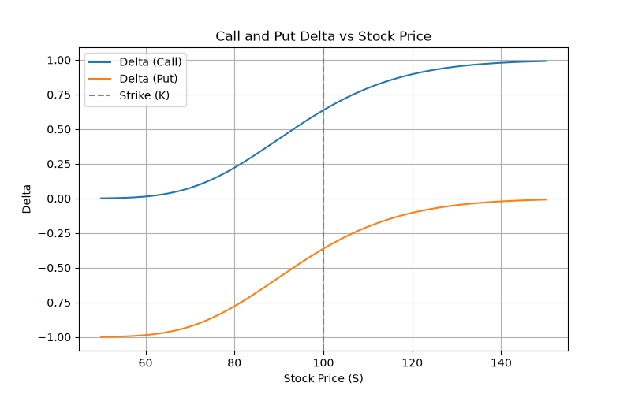
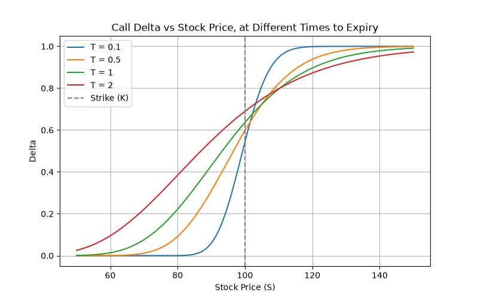
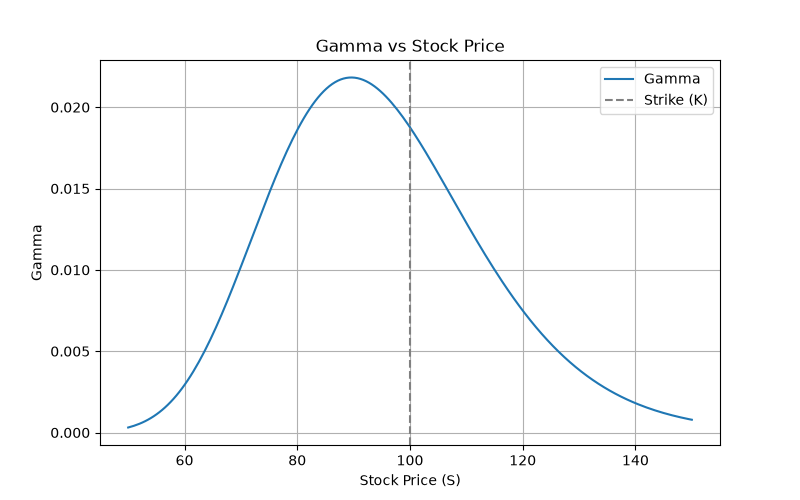
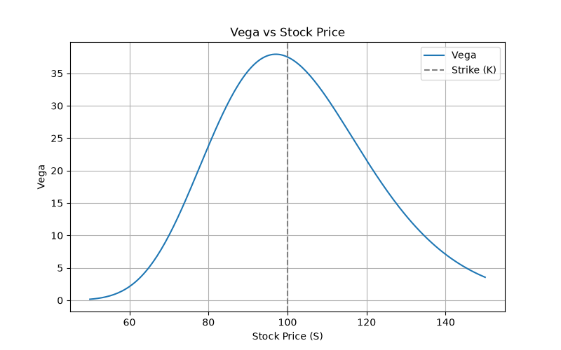

# Options Pricing & Volatility Analysis

A from-scratch implementation of options pricing models in Python, built as a way to
combine quantitative finance theory with practical software engineering.

This is an early, in-progress checkpoint. More models, analysis, and tooling are being
added incrementally.

## Current status (Phase 1)

- Black-Scholes pricing for European **call** and **put** options
- Put price derived from the call price via put-call parity
- `d1` / `d2` factored into shared helper functions (`calculate_d1`, `calculate_d2`) so
  other modules can reuse them
- Greeks: delta, gamma, vega, theta, rho (call and put where applicable)
- Plots of delta, gamma and vega against stock price (see [Plots](#plots) below)
- Verified against hand calculations

Everything else (implied volatility, additional models, tests, CLI, etc.) is planned
but not yet implemented — this README will be updated as those land.

## Usage

```bash
pip install -r requirements.txt
python black_scholes.py
python greeks.py
python plot_greeks.py
```

```python
from black_scholes import black_scholes_call, black_scholes_put
from greeks import delta_call, gamma, vega, theta_call, rho_call

call_price = black_scholes_call(S=100, K=100, T=1, r=0.05, sigma=0.2)
put_price = black_scholes_put(S=100, K=100, T=1, r=0.05, sigma=0.2)
call_delta = delta_call(S=100, K=100, T=1, r=0.05, sigma=0.2)
```

## Plots





Call delta plotted against stock price, for four different times to expiry. For the
short-dated option (T = 0.1) delta jumps quite sharply from 0 to 1 around the strike —
with so little time left, the option is close to knowing whether it'll finish in or out
of the money. The longer-dated curves (T = 1, T = 2) are much more gradual, since
there's more time for the stock price to move around before expiry, so it's harder to
say which way it'll end up.



Gamma vs stock price. Gamma is highest when the option is roughly at the money and
falls off the further S moves away from the strike in either direction. That makes
sense since gamma measures how fast delta changes — near the strike, a small move in
the stock price can flip the option from likely-to-finish-OTM to likely-to-finish-ITM,
so delta is moving fastest there. Deep in or out of the money, delta is already close
to 1 or 0, so it barely reacts to further moves in S.



Vega vs stock price. Same story as gamma — it peaks around the strike and decays on
both sides. This is because the option's value is most sensitive to volatility when
it's genuinely uncertain whether it'll expire in or out of the money (i.e. near the
strike). Deep ITM or OTM, the outcome is already fairly clear, so a change in sigma
doesn't move the price nearly as much.

**Parameters**

| Symbol | Meaning |
|--------|---------|
| `S` | Current price of the underlying asset |
| `K` | Strike price |
| `T` | Time to expiration, in years |
| `r` | Risk-free interest rate (annualized) |
| `sigma` | Volatility of the underlying (annualized) |

## Requirements

- Python 3.9+
- numpy
- scipy
- matplotlib

## License

MIT — see [LICENSE](LICENSE).
